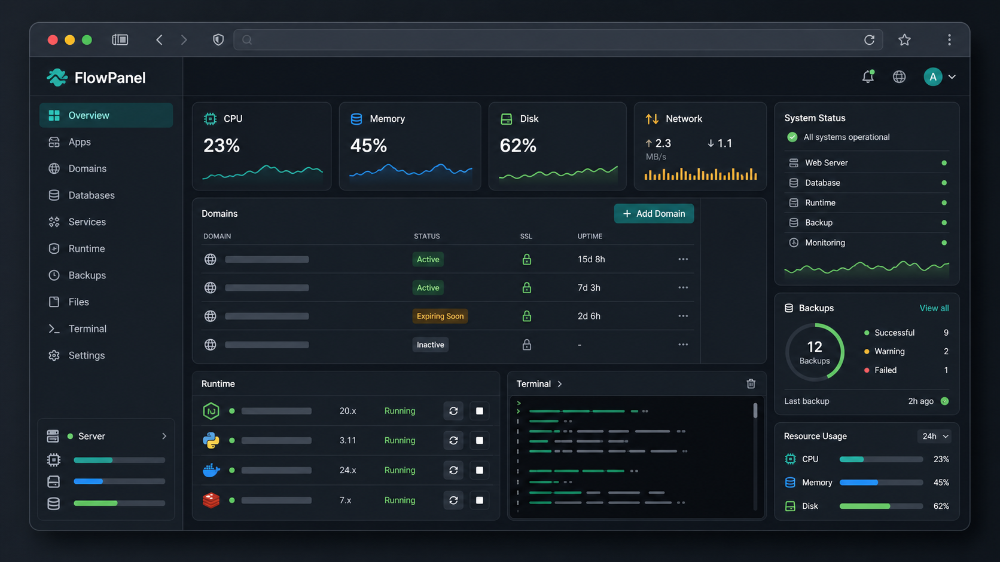

# FlowPanel

FlowPanel is a self-hosted server control panel for managing websites, runtimes, databases, files, backups, scheduled jobs, and common server services from one web UI.

The project is a Go service with an embedded React/Vite panel. The Go process serves the admin panel, stores state in SQLite, runs an embedded Caddy runtime for managed domains, and exposes APIs for operational tasks.



## Features

FlowPanel currently includes:

- Admin authentication with installer-provisioned credentials
- Dashboard with server details, resource charts, disk usage, site/database counts, and PM2 process status
- Domain management for static, PHP, Node.js, Python, and reverse-proxy sites
- Embedded Caddy routing for public HTTP/HTTPS traffic, panel proxying, caching, WAF, rate limits, IP rules, and auto-ban controls
- PHP/PHP-FPM management, per-domain PHP settings, Composer access, and PHP app templates for WordPress, Symfony, Laravel, October CMS, CakePHP, CodeIgniter, and Slim
- WordPress toolkit for status, core updates, plugins, themes, database details, and extension search/install actions
- GitHub deployment settings with optional push webhooks and post-fetch scripts
- Node.js, Go, PM2, Docker, Redis, MongoDB, PostgreSQL, FFmpeg, yt-dlp, MariaDB, and phpMyAdmin runtime controls
- Docker container, image, volume, network, log, exec, and Docker Hub search tools
- MariaDB database/user management and database dump downloads
- File manager with upload, download, edit, archive, extract, permissions, and transfer actions
- Browser terminal access to the local shell, including domain-scoped terminal access
- Cron jobs and scheduled backup jobs
- Local and Google Drive backup support with import, restore, download, and per-domain backup actions
- FTP runtime, global FTP accounts, and domain FTP account management
- Activity log, domain logs, system monitor, and Linux task-manager tools
- Webhook and SMTP notifications for disk pressure, failed backups, repeated login failures, certificate expiry, and recovery events

## Install / Update Latest Release

### Linux / macOS

```bash
curl -fsSL https://raw.githubusercontent.com/mzgs/FlowPanel/main/install.sh | sh
```

The installer exposes the admin panel over HTTPS on port `8443` and prints the generated username and password:

```text
https://SERVER_IP:8443
```

FlowPanel generates an ECDSA certificate containing the server's public, private, and loopback IP addresses. The connection is encrypted immediately. Because the initial certificate is self-signed, browsers show a trust warning until you import `/etc/flowpanel/admin.crt` (Linux) or `/usr/local/etc/flowpanel/admin.crt` (macOS) into the client computer's trust store. You can replace the generated certificate and key with a CA-issued IP certificate at the configured paths.

Allow inbound TCP port `8443` in the host or cloud firewall if it is filtered. Keep that port limited to trusted administrator IP addresses when practical.

## Requirements

For local development:

- Go 1.26.5 or newer
- Node.js and npm

For a production Linux host, install the system tools you expect FlowPanel to manage. Typical deployments need:

- `systemd`
- `caddy` dependencies are embedded through the Go binary, but ports `80` and `443` must be available to the FlowPanel process if public routing is enabled
- `php`, `php-fpm`, `composer`, `node`, `npm`, `pm2`, `docker`, `mariadb`, and other runtimes depending on which panels you use
- Firewall rules for the admin port, HTTP/HTTPS, and FTP/passive FTP ports if enabled

FlowPanel performs privileged server operations. Run it only on a machine where the FlowPanel administrator is also trusted with shell/root-level server access.

## Development

Run the backend and frontend dev server:

```bash
./run.sh
```

The backend defaults to `:8080`. The Vite dev server runs from `web/panel`.

Build only the frontend bundle:

```bash
./build.sh
```

Build a release binary:

```bash
./build.sh linux amd64
./build.sh linux arm64
./build.sh mac arm64
./build.sh windows amd64
```

The output is written to `dist/`.

## Configuration

FlowPanel is configured with environment variables.

| Variable | Default | Notes |
| --- | --- | --- |
| `FLOWPANEL_ENV` | `development` | Use `production` for deployed instances. |
| `FLOWPANEL_ENV_FILE` | empty | Path to the protected service environment file used by the installer. |
| `FLOWPANEL_ADMIN_LISTEN_ADDR` | `:8080` | Admin panel/API listen address. |
| `FLOWPANEL_ADMIN_TLS_CERT_FILE` | empty | Admin TLS certificate path. When both TLS paths are configured but absent, FlowPanel generates an IP-aware self-signed certificate. |
| `FLOWPANEL_ADMIN_TLS_KEY_FILE` | empty | Admin TLS private-key path. Must be configured with the certificate path. |
| `FLOWPANEL_PUBLIC_HTTP_ADDR` | `:80` | Embedded Caddy HTTP listen address. |
| `FLOWPANEL_PUBLIC_HTTPS_ADDR` | `:443` | Embedded Caddy HTTPS listen address. |
| `FLOWPANEL_PHPMYADMIN_ADDR` | `:32109` | Internal phpMyAdmin listen address. |
| `FLOWPANEL_DB_PATH` | platform default | SQLite database path. |
| `FLOWPANEL_SESSION_SECRET` | development secret | Must be explicitly set in production and at least 32 characters. |
| `FLOWPANEL_SESSION_COOKIE_NAME` | `flowpanel_session` | Admin session cookie name. |
| `FLOWPANEL_SESSION_COOKIE_SECURE` | `false` | Set to `true` only when the admin panel is served exclusively over HTTPS. |
| `FLOWPANEL_SESSION_LIFETIME` | `24h` | Go duration string. |
| `FLOWPANEL_ADMIN_USERNAME` | empty | Initial admin username. Used only when no panel users exist. |
| `FLOWPANEL_ADMIN_PASSWORD` | empty | Initial admin password. Used only when no panel users exist. |
| `FLOWPANEL_MARIADB_PASSWORD` | empty | MariaDB root password. Installer deployments persist it in the protected service environment file. |
| `FLOWPANEL_SHUTDOWN_TIMEOUT` | `10s` | Graceful shutdown timeout. |
| `FLOWPANEL_CRON_ENABLED` | `true` | Enables persisted cron jobs. |
| `FLOWPANEL_FIREWALL_ENABLED` | `false` | Initial managed-firewall state. New Linux installations set this to `true`; the saved Security panel state takes precedence afterward. |
| `FLOWPANEL_GOOGLE_DRIVE_CLIENT_ID` | empty | Set with client secret for Google Drive backups. |
| `FLOWPANEL_GOOGLE_DRIVE_CLIENT_SECRET` | empty | Set with client ID for Google Drive backups. |
| `FLOWPANEL_GOOGLE_DRIVE_CREDENTIALS_PATH` | platform default | OAuth token storage path. |

On production, set at least:

```bash
FLOWPANEL_ENV=production
FLOWPANEL_ENV_FILE=<path to service env file>
FLOWPANEL_SESSION_SECRET=<random 32+ character secret>
FLOWPANEL_ADMIN_USERNAME=<admin username>
FLOWPANEL_ADMIN_PASSWORD=<admin password>
FLOWPANEL_ADMIN_LISTEN_ADDR=0.0.0.0:8443
FLOWPANEL_ADMIN_TLS_CERT_FILE=/etc/flowpanel/admin.crt
FLOWPANEL_ADMIN_TLS_KEY_FILE=/etc/flowpanel/admin.key
FLOWPANEL_SESSION_COOKIE_SECURE=true
```

Never expose the admin panel over unencrypted HTTP. Use its native TLS listener, a trusted HTTPS reverse proxy, or keep it on loopback behind an SSH tunnel or VPN.

## Monitoring and notifications

Notification channels and alert thresholds are configured from **Settings → Notifications**. Webhook requests can be authenticated with the `X-FlowPanel-Signature` HMAC-SHA256 header. SMTP supports STARTTLS and implicit TLS. Failed deliveries are persisted in SQLite and retried with exponential backoff.

FlowPanel checks disk pressure after three consecutive high-usage samples, scheduled and manual backup failures, repeated sign-in failures, and certificate validity or expiry. Recovery notifications can be enabled per installation.

Monitor FlowPanel itself from another host using:

```text
https://SERVER_IP:8443/healthz
```

An external monitor is required for panel or server downtime because an offline FlowPanel process cannot send its own notification.
