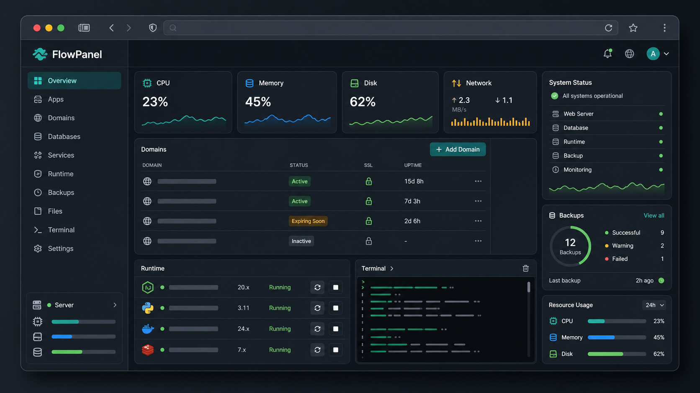

# FlowPanel

FlowPanel is a self-hosted server control panel for managing websites, runtimes, databases, files, backups, scheduled jobs, and common server services from one web UI.

The project is a Go service with an embedded React/Vite panel. The Go process serves the admin panel, stores state in SQLite, manages a persistent Caddy runtime for domains, and exposes APIs for operational tasks.



## Features

FlowPanel currently includes:

- Admin authentication with installer-provisioned credentials
- Dashboard with server details, resource charts, disk usage, site/database counts, and PM2 process status
- Domain management for static, PHP, Node.js, Python, and reverse-proxy sites
- Persistent Caddy routing for public HTTP/HTTPS traffic, panel proxying, caching, WAF, rate limits, IP rules, and auto-ban controls
- PHP/PHP-FPM management, per-domain PHP settings, Composer access, and PHP app templates for WordPress, Symfony, Laravel, October CMS, CakePHP, CodeIgniter, and Slim
- WordPress toolkit for status, core updates, plugins, themes, database details, and extension search/install actions
- GitHub deployment settings with optional push webhooks and post-fetch scripts
- Node.js, Go, PM2, Docker, Redis, MongoDB, PostgreSQL, FFmpeg, ImageMagick, yt-dlp, MariaDB, and phpMyAdmin runtime controls
- Linux yt-dlp installs include FFmpeg, the Deno JavaScript runtime, and EJS challenge-solver configuration
- Docker container, image, volume, network, log, exec, and Docker Hub search tools
- MariaDB database/user management and database dump downloads
- File manager with upload, download, edit, archive, extract, permissions, and transfer actions
- Browser terminal access to the local shell, including domain-scoped terminal access
- Cron jobs and scheduled backup jobs
- Local and Google Drive backup support with import, restore, download, and per-domain backup actions
- FTP runtime, global FTP accounts, and domain FTP account management
- Activity log, domain logs, system monitor, and Linux task-manager tools
- Webhook and SMTP notifications for disk pressure, failed backups, repeated login failures, certificate expiry, and recovery events

## Install / Update Latest Release

### Linux / macOS

```bash
curl -fsSL https://raw.githubusercontent.com/mzgs/FlowPanel/main/install.sh | sh
```

The installer exposes the admin panel over HTTPS on port `8443` and prints the generated username and password:

```text
https://SERVER_IP:8443
```

FlowPanel generates an ECDSA certificate containing the server's public, private, and loopback IP addresses. The connection is encrypted immediately. Because the initial certificate is self-signed, browsers show a trust warning until you import `/etc/flowpanel/admin.crt` (Linux) or `/usr/local/etc/flowpanel/admin.crt` (macOS) into the client computer's trust store. You can replace the generated certificate and key with a CA-issued IP certificate at the configured paths.

Allow inbound TCP port `8443` in the host or cloud firewall if it is filtered. Keep that port limited to trusted administrator IP addresses when practical.

## Requirements

For local development:

- Go 1.26.5 or newer
- Node.js and npm

For a production Linux host, install the system tools you expect FlowPanel to manage. Typical deployments need:

- `systemd`
- `caddy` dependencies are embedded through the Go binary, but ports `80` and `443` must be available to the FlowPanel process if public routing is enabled
- `php`, `php-fpm`, `composer`, `node`, `npm`, `pm2`, `docker`, `mariadb`, and other runtimes depending on which panels you use
- Firewall rules for the admin port, HTTP/HTTPS, and FTP/passive FTP ports if enabled

FlowPanel performs privileged server operations. Run it only on a machine where the FlowPanel administrator is also trusted with shell/root-level server access.

## Development

Run the backend and frontend dev server:

```bash
./run.sh
```

The backend defaults to `:8080`. The Vite dev server runs from `web/panel`.

Build only the frontend bundle:

```bash
./build.sh
```

Build a release binary:

```bash
./build.sh linux amd64
./build.sh linux arm64
./build.sh mac arm64
./build.sh windows amd64
```

The output is written to `dist/`.

## Configuration

Linux production installations protect managed workloads with systemd and cgroup v2.
Docker containers, PM2 applications, PHP-FPM workers, deployment commands and cron
jobs share `flowpanel-workloads.slice`: at most 75% of all CPU cores and 70% of
physical RAM, memory throttling at 60%, no workload swap, and 4096 tasks combined.
Each container, command scope and PHP-FPM service allows at most 512 tasks
(processes and threads). SSH and the FlowPanel admin service remain outside this
slice. Native application processes live in PM2's separate systemd scope; builds
run in temporary scopes that are stopped, including their descendants, on exit
or cancellation. PM2 uses restart backoff and PHP-FPM uses bounded service restarts.

Within that ceiling, PHP-FPM versions share `flowpanel-workloads-php.slice` and
everything else uses `flowpanel-workloads-apps.slice`. During CPU contention,
PHP's default weight gives it 15% of the shared workload CPU capacity; idle CPU
shares can be borrowed, so PHP can use up to the full 75% host CPU ceiling when
available. This is scheduler weighting, not a guaranteed response time or a
dedicated CPU reservation.

PHP has reclaim protection for 10% of physical RAM, shared across all PHP versions
and sites. Other workloads are capped at 60% of physical RAM (the shared 70% ceiling
minus PHP's 10% baseline) and 3584 tasks, leaving room for PHP's baseline and 512
tasks. PHP has no additional RAM cap and can grow to the shared 70% ceiling when
capacity is available. The RAM baseline stays unavailable to other workloads even
when PHP is idle; lending unreclaimable application RAM would undermine that floor.
These defaults need tuning to the actual PHP workload and do not guarantee site
availability if PHP itself exceeds its available resources.

Protection is enabled by the Linux installer and defaults on for Linux production.
It requires root, systemd 254 or newer, cgroup v2 CPU/memory/PID controllers, and
Docker's systemd cgroup driver. Unsupported protection refuses workload launches
rather than running them without limits; the admin panel logs setup errors and
remains available. macOS and development installs retain their existing behavior.

Activation moves existing PM2 and PHP-FPM workers into the workload slice with a
one-time restart. Existing Docker containers must be explicitly recreated to
join the apps slice, including containers enrolled directly in the older shared
slice; stop/delete remain available, but start/restart and backups of running
unenrolled containers are refused. Existing running containers outside the apps
slice do not receive PHP reserve protection until migrated; recreating a container
preserves mapped volumes but discards its writable layer, so save any needed data
first. Containers created
outside FlowPanel are not automatically enrolled. This protection covers CPU,
RAM, swap and task counts; it does not impose disk-space or disk-I/O limits.

After deployment, run `sudo sh scripts/check-workload-protection.sh` to verify the
kernel ceilings and command placement without generating load.

FlowPanel is configured with environment variables.

| Variable | Default | Notes |
| --- | --- | --- |
| `FLOWPANEL_ENV` | `development` | Use `production` for deployed instances. |
| `FLOWPANEL_WORKLOAD_PROTECTION` | Linux production: `true`; otherwise `false` | Enable systemd workload isolation; disabling leaves existing slice limits in place. |
| `FLOWPANEL_WORKLOAD_CPU_PERCENT` | `75` | Combined workload CPU budget as a percentage of all cores, from 1 to 90. Restart FlowPanel after changing. |
| `FLOWPANEL_WORKLOAD_MEMORY_PERCENT` | `70` | Combined workload RAM ceiling as a percentage of physical RAM, from 1 to 90. Throttling begins at six-sevenths of this ceiling. Restart FlowPanel after changing. |
| `FLOWPANEL_PHP_CPU_SHARE_PERCENT` | `15` | PHP's relative share of the workload CPU budget during contention, from 1 to 90. Spare capacity can be borrowed. Restart FlowPanel after changing. |
| `FLOWPANEL_PHP_MEMORY_RESERVE_PERCENT` | `10` | Physical RAM baseline protected for all PHP workers, from 1 to 90 and below the shared RAM ceiling. Other workloads' RAM cap is the shared ceiling minus this baseline. Restart FlowPanel after changing. |
| `FLOWPANEL_ENV_FILE` | empty | Path to the protected service environment file used by the installer. |
| `FLOWPANEL_ADMIN_LISTEN_ADDR` | `:8080` | Admin panel/API listen address. |
| `FLOWPANEL_ADMIN_TLS_CERT_FILE` | empty | Admin TLS certificate path. When both TLS paths are configured but absent, FlowPanel generates an IP-aware self-signed certificate. |
| `FLOWPANEL_ADMIN_TLS_KEY_FILE` | empty | Admin TLS private-key path. Must be configured with the certificate path. |
| `FLOWPANEL_PUBLIC_HTTP_ADDR` | `:80` | Caddy HTTP listen address. |
| `FLOWPANEL_PUBLIC_HTTPS_ADDR` | `:443` | Caddy HTTPS listen address. |
| `FLOWPANEL_CADDY_ADMIN_ADDR` | empty | Local Caddy administration address. Installations use a permissioned Unix socket so Caddy can remain online across panel updates. |
| `FLOWPANEL_SECURITY_EVENT_SOCKET` | empty | Unix datagram socket used by the persistent Caddy process to deliver security events to FlowPanel. |
| `FLOWPANEL_PHPMYADMIN_ADDR` | `:32109` | Internal phpMyAdmin listen address. |
| `FLOWPANEL_DB_PATH` | platform default | SQLite database path. |
| `FLOWPANEL_SESSION_SECRET` | development secret | Must be explicitly set in production and at least 32 characters. |
| `FLOWPANEL_SESSION_COOKIE_NAME` | `flowpanel_session` | Admin session cookie name. |
| `FLOWPANEL_SESSION_COOKIE_SECURE` | `false` | Set to `true` only when the admin panel is served exclusively over HTTPS. |
| `FLOWPANEL_SESSION_LIFETIME` | `24h` | Go duration string. |
| `FLOWPANEL_ADMIN_USERNAME` | empty | Initial admin username. Used only when no panel users exist. |
| `FLOWPANEL_ADMIN_PASSWORD` | empty | Initial admin password. Used only when no panel users exist. |
| `FLOWPANEL_MARIADB_PASSWORD` | empty | MariaDB root password. Installer deployments persist it in the protected service environment file. |
| `FLOWPANEL_SHUTDOWN_TIMEOUT` | `10s` | Graceful shutdown timeout. |
| `FLOWPANEL_CRON_ENABLED` | `true` | Enables persisted cron jobs. |
| `FLOWPANEL_FIREWALL_ENABLED` | `false` | Initial managed-firewall state. New Linux installations set this to `true`; the saved Security panel state takes precedence afterward. |
| `FLOWPANEL_GOOGLE_DRIVE_CLIENT_ID` | empty | Set with client secret for Google Drive backups. |
| `FLOWPANEL_GOOGLE_DRIVE_CLIENT_SECRET` | empty | Set with client ID for Google Drive backups. |
| `FLOWPANEL_GOOGLE_DRIVE_CREDENTIALS_PATH` | platform default | OAuth token storage path. |

On production, set at least:

```bash
FLOWPANEL_ENV=production
FLOWPANEL_ENV_FILE=<path to service env file>
FLOWPANEL_SESSION_SECRET=<random 32+ character secret>
FLOWPANEL_ADMIN_USERNAME=<admin username>
FLOWPANEL_ADMIN_PASSWORD=<admin password>
FLOWPANEL_ADMIN_LISTEN_ADDR=0.0.0.0:8443
FLOWPANEL_ADMIN_TLS_CERT_FILE=/etc/flowpanel/admin.crt
FLOWPANEL_ADMIN_TLS_KEY_FILE=/etc/flowpanel/admin.key
FLOWPANEL_SESSION_COOKIE_SECURE=true
```

Never expose the admin panel over unencrypted HTTP. Use its native TLS listener, a trusted HTTPS reverse proxy, or keep it on loopback behind an SSH tunnel or VPN.

## Monitoring and notifications

Notification channels and alert thresholds are configured from **Settings → Notifications**. Webhook requests can be authenticated with the `X-FlowPanel-Signature` HMAC-SHA256 header. SMTP supports STARTTLS and implicit TLS. Failed deliveries are persisted in SQLite and retried with exponential backoff.

FlowPanel checks disk pressure after three consecutive high-usage samples, scheduled and manual backup failures, repeated sign-in failures, and certificate validity or expiry. Recovery notifications can be enabled per installation.

Monitor FlowPanel itself from another host using:

```text
https://SERVER_IP:8443/healthz
```

An external monitor is required for panel or server downtime because an offline FlowPanel process cannot send its own notification.
